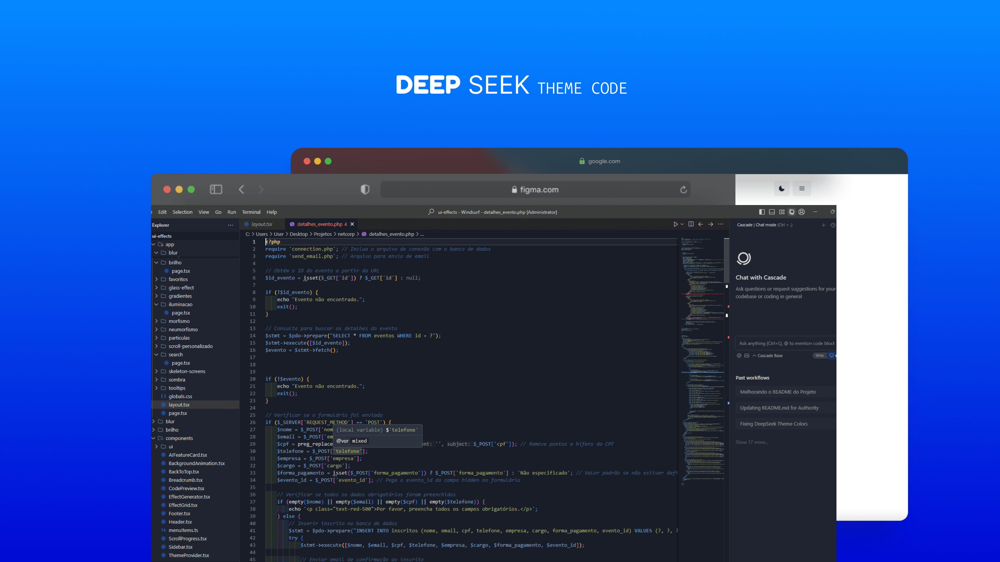

# DeepSeek Theme para Visual Studio Code

Um tema escuro moderno e elegante para o Visual Studio Code, inspirado no DeepSeek. Projetado para melhorar sua experiência de programação com foco na legibilidade e estética.




---

## Recursos
- **Modo Escuro**: Confortável para os olhos durante longas sessões de programação.
- **Destaque de Sintaxe**: Otimizado para legibilidade em várias linguagens de programação.
- **Personalizável**: Ajuste as cores facilmente para atender às suas preferências.

---

## Instalação

### Via Visual Studio Code Marketplace
1. Abra o **Visual Studio Code**.
2. Vá para a visão de **Extensões** clicando no ícone de Extensões na Barra de Atividades no lado da janela ou pressionando `Ctrl+Shift+X`.
3. Pesquise por `DeepSeek Theme`.
4. Clique em **Instalar** para instalar o tema.
5. Após a instalação, abra a **Paleta de Comandos** (`Ctrl+Shift+P`) e digite `Preferences: Color Theme`.
6. Selecione **DeepSeek Theme** na lista.

### Instalação Manual
1. Baixe o arquivo `.vsix` da página de [Releases](https://github.com/aquinogui/deepseek-theme/releases).
2. Abra o **Visual Studio Code**.
3. Vá para a visão de **Extensões** (`Ctrl+Shift+X`).
4. Clique no menu `...` e selecione **Instalar a partir de VSIX**.
5. Escolha o arquivo `.vsix` baixado e clique em **Instalar**.

---

## Como Usar

1. Após instalar o tema, abra a **Paleta de Comandos** (`Ctrl+Shift+P`).
2. Digite `Preferences: Color Theme` e selecione a opção.
3. Escolha **DeepSeek Theme** na lista de temas disponíveis.
4. Aproveite para programar com o DeepSeek Theme! 🎉

---

## Personalização

Se você deseja personalizar o tema, pode editar o arquivo `theme.json` na pasta da extensão. Siga os passos abaixo:

1. Localize a pasta da extensão:
   - No Windows: `%USERPROFILE%\.vscode\extensions\deepseek-theme-1.0.0`
   - No macOS/Linux: `~/.vscode/extensions/deepseek-theme-1.0.0`
2. Abra o arquivo `theme.json` e modifique as cores conforme necessário.
3. Recarregue o Visual Studio Code para aplicar as alterações.

---

## Configurações Recomendadas

Para uma melhor experiência, recomendamos usar as seguintes configurações no arquivo `settings.json`:

```json
{
  "editor.fontSize": 13,
  "editor.fontFamily": "'Fira Code', 'Consolas', 'Courier New', monospace",
  "editor.lineHeight": 24,
  "editor.tabSize": 2,
  "editor.wordWrap": "on",
  "workbench.colorTheme": "DeepSeek Theme"
}